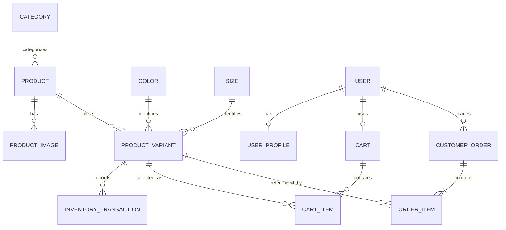

# Database Design — E-commerce

**Trạng thái:** Baseline Round 0 hoàn tất ngày 2026-09-25. Đây là schema contract dùng để bắt đầu Round 1; khi tạo Flyway migration phải kiểm tra mapping với phiên bản MySQL/Hibernate được chọn và ghi nhận khác biệt có chủ ý.

## 1. Mục đích và nguồn chuẩn

Tài liệu này nối business domain với MySQL schema và quy tắc persistence của Spring Boot:

```text
Requirement / feature
  → Domain model + ERD
  → Table/column/constraint contract
  → Flyway migration
  → JPA entity / repository
  → DTO / service / API
```

- `DATABASE_DESIGN.md` là nguồn chuẩn cho ý nghĩa bảng, quan hệ và ràng buộc đã được duyệt.
- Flyway migration là nguồn chuẩn cho schema thực sự được triển khai.
- JPA entity ánh xạ schema; không dùng Hibernate tự tạo/cập nhật schema.
- Nếu tài liệu và migration khác nhau, phải xác định migration nào đã áp dụng và cập nhật tài liệu theo quyết định có ghi nhận; không sửa lịch sử migration đã áp dụng.

## 2. Domain trong Master Plan

Các domain: `User`, `UserProfile`, `Category`, `Product`, `ProductImage`, `Color`, `Size`, `ProductVariant`, `Cart`, `CartItem`, `Order`, `OrderItem`, `InventoryTransaction`. Theo quyết định hiện tại, hồ sơ address nằm trong `UserProfile`; chưa tạo bảng `Address` riêng. Stock hiện tại lưu trên `ProductVariant`; lịch sử điều chỉnh có thể lưu ở `InventoryTransaction`, không cần bảng current-stock `Inventory` trùng lặp.

### ERD khái niệm — baseline Round 0



Color/Size là record nhập tự do dùng chung toàn hệ thống. Các ràng buộc chi tiết được quy định trong physical contract ở dưới.

- Product thuộc đúng một Category; Category không phân cấp.
- Một ProductVariant là tổ hợp Color + Size của Product (ví dụ S + đen); Color/Size do admin nhập tự do, lưu thành record dùng chung toàn hệ thống để Variant tham chiếu. Unique tổ hợp trong cùng Product.
- Stock hiện tại là cột của ProductVariant; không duy trì thêm số stock current ở bảng Inventory.
- Mỗi User có tối đa một Cart; CartItem chọn ProductVariant.
- User có một hồ sơ riêng 1:1 gồm `name`, `phone_number`, `address`; user có một địa chỉ duy nhất. Order snapshot tên người nhận, số điện thoại, địa chỉ và ghi chú giao hàng tại thời điểm đặt.
- Mỗi ProductVariant có SKU; SKU unique trong các Variant active và được phép tái sử dụng sau khi Variant cũ soft delete.
- Order lưu snapshot tên người nhận, số điện thoại, địa chỉ giao hàng và ghi chú tại thời điểm đặt.
- OrderItem lưu snapshot tên sản phẩm, SKU, Color, Size, giá và quantity tại thời điểm mua; không lưu image path snapshot. FK tới variant (nếu giữ) chỉ phục vụ tham chiếu.
- Soft delete áp dụng cho Category, Product, ProductVariant, User/UserProfile; Order và InventoryTransaction là lịch sử, không xóa vật lý.
- `User` lưu ID/subject của user trong Keycloak với tính duy nhất; không lưu mật khẩu Keycloak trong MySQL.

## 3. Quy tắc schema đề xuất

Các quy tắc dưới đây là baseline đã duyệt. Chi tiết tương thích với phiên bản database/provider cụ thể được xác minh lúc khởi tạo project và migration đầu tiên.

- Tên bảng/cột vật lý dùng `snake_case`; tên bảng dùng số ít (`product`, `order_item`) theo quyết định đã chốt.
- Mỗi bảng dùng Java `UUID` làm khóa chính, sinh bằng JPA `@GeneratedValue(strategy = GenerationType.UUID)`; không viết generator riêng. Với Hibernate mặc định và MySQL không có native UUID column type, dùng binary representation (`BINARY(16)`) trừ khi version/dialect thực tế cho thấy mapping khác. Flyway column type phải khớp mapping Hibernate.
- Khai báo `NOT NULL`, `UNIQUE`, `CHECK` và FK theo invariant nghiệp vụ; không chỉ dựa vào validation ở UI/service. Với MySQL, xác minh phiên bản hỗ trợ/enforce CHECK constraint.
- Tạo index theo query/access pattern đã xác định (lookup, filter, sort, pagination, FK); ghi lý do từng index. Tránh thêm index không gắn với truy vấn.
- Giá lưu bằng số nguyên VND, không lưu chuỗi đã format và không dùng floating point; ví dụ `100.000 VND` hiển thị thì lưu `100000`. Dùng MySQL `BIGINT` có dấu và Java `Long`/`long`; tiền tệ hiện cố định VND.
- Múi giờ lưu/nghiệp vụ là giờ Việt Nam `Asia/Ho_Chi_Minh` (UTC+07:00), theo quyết định của user. Lưu local date-time theo múi giờ này trong MySQL `DATETIME(6)`; API ghi offset `+07:00`. Vì MySQL `DATETIME` không mang metadata timezone, backend phải luôn diễn giải giá trị theo `Asia/Ho_Chi_Minh`.
- Quantity/stock phải có quy tắc không âm và giới hạn phù hợp với nghiệp vụ.
- Các status trong Master Plan (`PENDING`, `CONFIRMED`, `PROCESSING`, `SHIPPING`, `DELIVERED`, `CANCELLED`; payment `UNPAID`, `PAID`; method `COD`) lưu thành chuỗi tường minh trong DB và Java (`VARCHAR`, JPA `EnumType.STRING`), không lưu ordinal số.
- Ảnh sản phẩm: file nằm trên filesystem ngoài classpath; DB lưu `storage_key` tương đối (ví dụ `products/<productUuid>/<imageUuid>.webp`), không lưu binary, absolute path hoặc URL public. Local root mặc định là `e_commerce_be/uploads/products/` trong monorepo; backend trả ảnh qua API.

### Quy tắc theo quyết định đã xác nhận

- `category` là một cấp; mỗi `product` bắt buộc thuộc đúng một category (FK không null).
- Unique tổ hợp variant trên `(product_id, color_id, size_id)`; một product không có hai variant cùng color-size. Variant luôn có đúng một Color và một Size.
- Color và Size do admin nhập tự do; lưu thành record dùng chung toàn hệ thống trong `color`/`size` để Variant tham chiếu bằng FK, không dùng enum hoặc danh mục giá trị cố định.
- SKU phải unique trong các Variant active; SKU của Variant đã soft delete có thể tái sử dụng. Enforce bằng generated nullable key `active_sku` (`CASE WHEN deleted_at IS NULL THEN sku ELSE NULL END`) và unique index trên key này; xác minh generated-column DDL với phiên bản MySQL khi migration.
- `product_variant` sở hữu stock hiện tại. Mỗi lần thay đổi stock phải tạo transaction ghi Variant, delta, stock trước/sau, lý do, actor, thời điểm và order reference nếu phát sinh từ Order.
- `cart.user_id` phải unique để bảo đảm tối đa một cart cho mỗi user.
- Unique `(cart_id, product_variant_id)` để cùng một Variant chỉ có một dòng trong Cart; cập nhật quantity trên dòng đó.
- `user_profile.user_id` phải unique và FK tới `user`; profile gồm `name`, `phone_number`, `address`.
- `user.keycloak_user_id` phải unique để ánh xạ một local user tới đúng identity Keycloak.
- Order giữ snapshot tên người nhận, số điện thoại, địa chỉ giao hàng và ghi chú; OrderItem giữ snapshot tên sản phẩm, SKU, Color, Size, giá mua và quantity, không lưu image path.
- Dùng soft delete cho Category, Product, ProductVariant và User/UserProfile; Order và InventoryTransaction được giữ như lịch sử, không cho xóa vật lý. SKU có thể tái sử dụng sau khi Variant soft delete.
- Mỗi lần thay đổi stock ghi InventoryTransaction gồm Variant, quantity delta, stock before/after, reason, actor, timestamp và Order reference tùy nguồn thay đổi.
- Dự án dùng chung một Git repository (monorepo), một React app cho Customer/Admin và backend Spring Boot; docs shared ở `C:\Users\Public\Learn\E-comerce\docs`.
- REST API dùng JSON dưới `/api/v1`, pagination bằng `page`/`size`; lỗi có `timestamp`, `status`, `code`, `message`, `path` và `fieldErrors` khi validation lỗi.
- Lưu file ảnh ở `e_commerce_be/uploads/products/` trong local; DB lưu storage key tương đối như `products/<productUuid>/<imageUuid>.webp`. Admin upload qua API; client hiển thị ảnh bằng URL API công khai cho ảnh sản phẩm đang hiển thị. Backend resolve key dưới configured storage root và từ chối path thoát khỏi root. Production chỉ đổi configured root sang thư mục/volume persistent; giữ nguyên storage key và API contract. Không lưu ảnh trong JAR/resources và không thêm object storage.
- PK của các bảng dùng Java `UUID` và JPA `GenerationType.UUID`; MySQL dùng binary UUID mapping mặc định của Hibernate (`BINARY(16)`), không thêm UUID generator/custom converter.
- VND là đơn vị tiền duy nhất hiện tại; lưu số đồng nguyên, ví dụ `100.000 VND` → `100000`, trong signed `BIGINT`; frontend chỉ format để hiển thị.
- Lưu thời gian trực tiếp theo giờ Việt Nam UTC+07:00 trong `DATETIME(6)`; Java dùng `LocalDateTime` với quy ước ứng dụng `Asia/Ho_Chi_Minh`; API serialize ISO 8601 có offset `+07:00`. Không dựa vào timezone mặc định của máy chạy.
- Ảnh ProductImage giữ storage key; binary file ở nơi lưu ảnh.
- Enum lưu thành string (`VARCHAR`, Java `EnumType.STRING`) để DB dễ đọc và tránh ordinal phụ thuộc thứ tự enum.
- MySQL hỗ trợ fractional seconds đến 6 chữ số. `DATETIME` không tự chuyển timezone và có range rộng hơn `TIMESTAMP`; `TIMESTAMP` tự chuyển đổi giữa session timezone và UTC và giới hạn đến năm 2038 trong MySQL 8.4. Xem [MySQL DATE, DATETIME, and TIMESTAMP](https://dev.mysql.com/doc/refman/8.4/en/datetime.html).

## 4. Bảng thiết kế chi tiết — điền trước khi code feature

Với mỗi bảng, hoàn thiện bảng đặc tả sau. Không tạo entity chỉ từ tên domain.

| Thuộc tính cần chốt | Nội dung |
|---|---|
| Mục đích / owner | Business invariant được bảng bảo vệ |
| Columns | Tên, kiểu MySQL, nullable, default, ý nghĩa |
| Primary key | Tên, kiểu, generation |
| Foreign keys | Cột nguồn → bảng/cột đích; delete/update behavior |
| Unique constraints | Phạm vi duy nhất và lý do |
| Check constraints | Quy tắc miền như giá/stock/quantity |
| Indexes | Index, thứ tự cột, query được hỗ trợ |
| Lifecycle | Tạo/sửa/xóa/archive, audit fields nếu cần |
| Data examples | Một record hợp lệ và biên quan trọng |
| Spring mapping | Entity/enum/relationship và repository query cần có |

### Thứ tự thiết kế gợi ý

1. Category, Product, ProductImage, Color, Size, ProductVariant.
2. User, UserProfile, Cart, CartItem.
3. Order, OrderItem, InventoryTransaction (current stock nằm trong ProductVariant).
4. Rà soát FK, delete behavior, unique rules, index theo toàn bộ feature/query.

Thứ tự này là gợi ý thiết kế theo dependency, không ép buộc thứ tự migration nếu schema cần khác.

### Physical schema baseline — Round 0

Quy ước chung: InnoDB, `utf8mb4`; PK UUID sinh từ Java theo `GenerationType.UUID`, migration dùng `BINARY(16)` sau khi xác nhận generated DDL; timestamps `DATETIME(6)` theo `Asia/Ho_Chi_Minh`; bảng/cột `snake_case`; `created_at DATETIME(6)` bắt buộc, `updated_at DATETIME(6)` trên bản ghi mutable; soft delete dùng nullable `deleted_at DATETIME(6)`. FK dùng `ON DELETE RESTRICT` (không hard-delete dữ liệu nghiệp vụ); cascade chỉ được ở ứng dụng cho child row không có lịch sử, nhưng không cascade remove JPA. Domain User ánh xạ vào table `app_user` để tránh tên table gây nhầm với cú pháp/từ khóa database.

Các cột dưới đây là contract cho migration đầu tiên; cột hiển thị là `NOT NULL` trừ khi ghi nullable. Tên enum là String; giá trị hợp lệ liệt kê ở từng bảng. Mọi FK có index (unique FK có unique index).

| Table | Cột và kiểu dữ liệu | Quan hệ / ràng buộc / index |
|---|---|---|
| `app_user` | `id BINARY(16) PK`, `keycloak_user_id VARCHAR(36)`, `created_at`, `updated_at`, `deleted_at DATETIME(6) NULL` | `keycloak_user_id` unique; soft delete. Không lưu password hoặc role trùng lặp; role authority lấy từ Keycloak token. |
| `user_profile` | `id`, `user_id BINARY(16)`, `name VARCHAR(120)`, `phone_number VARCHAR(30)`, `address VARCHAR(500)`, `created_at`, `updated_at`, `deleted_at NULL` | `user_id` unique FK `app_user`; 1:1, soft delete đồng bộ user. |
| `category` | `id`, `name VARCHAR(120)`, `description VARCHAR(1000) NULL`, `created_at`, `updated_at`, `deleted_at NULL` | Tên active unique (generated nullable `active_name` + unique index); category một cấp. |
| `product` | `id`, `category_id BINARY(16)`, `name VARCHAR(200)`, `description TEXT NULL`, `base_price BIGINT`, `sale_price BIGINT NULL`, timestamps, `deleted_at NULL` | FK category; index `(category_id,created_at)` cho list/filter; `base_price >= 0`; sale null hoặc `0 <= sale_price <= base_price`. Chỉ product chưa soft-delete xuất hiện ở customer catalog. |
| `product_image` | `id`, `product_id BINARY(16)`, `storage_key VARCHAR(500)`, `content_type VARCHAR(100)`, `sort_order INT`, `created_at` | FK product; storage key unique; index `(product_id,sort_order)`; image binary nằm filesystem, không soft-delete ảnh độc lập ở schema baseline; xóa ảnh xử lý qua use case và xóa file an toàn. |
| `color` | `id`, `name VARCHAR(80)`, `created_at`, `updated_at`, `deleted_at NULL` | Active name unique qua generated nullable `active_name`; free text nhập bởi Admin, record dùng chung. |
| `size` | `id`, `name VARCHAR(40)`, `created_at`, `updated_at`, `deleted_at NULL` | Active name unique qua generated nullable `active_name`; free text nhập bởi Admin, record dùng chung. |
| `product_variant` | `id`, `product_id`, `color_id`, `size_id`, `sku VARCHAR(80)`, `stock_quantity INT`, timestamps, `deleted_at NULL` | FK product/color/size; giá lấy từ Product; stock `>=0`; unique active SKU bằng generated nullable `active_sku`; unique active tổ hợp bằng generated nullable `active_combination_key`; index `(product_id,deleted_at)`. |
| `inventory_transaction` | `id`, `product_variant_id`, `quantity_delta INT`, `stock_before INT`, `stock_after INT`, `reason VARCHAR(30)`, `actor_user_id BINARY(16) NULL`, `customer_order_id BINARY(16) NULL`, `note VARCHAR(500) NULL`, `created_at` | FK variant, actor, optional order; append-only; `stock_after = stock_before + quantity_delta`; reason `RECEIVE`/`ADJUSTMENT`/`ORDER_DEDUCTION`/`ORDER_CANCELLATION`; index `(product_variant_id,created_at)` và optional order FK index. |
| `cart` | `id`, `user_id`, `created_at`, `updated_at` | FK app_user; unique `user_id` bảo đảm tối đa một cart/user. Cart giữ lại khi trống; không soft delete. |
| `cart_item` | `id`, `cart_id`, `product_variant_id`, `quantity INT`, `created_at`, `updated_at` | FK cart/variant; unique `(cart_id,product_variant_id)`; quantity `>0`; index FK; chỉ cho thêm variant active. |
| `customer_order` | `id`, `user_id`, `order_number VARCHAR(40)`, `recipient_name VARCHAR(120)`, `recipient_phone VARCHAR(30)`, `shipping_address VARCHAR(500)`, `delivery_note VARCHAR(500) NULL`, `subtotal_amount BIGINT`, `total_amount BIGINT`, `order_status VARCHAR(20)`, `payment_method VARCHAR(20)`, `payment_status VARCHAR(20)`, `created_at`, `updated_at` | FK user; `order_number` unique; index `(user_id,created_at)` và `(order_status,created_at)`; tiền không âm; COD only; statuses theo workflow trong Architecture. Không soft delete. |
| `order_item` | `id`, `customer_order_id`, `product_variant_id BINARY(16) NULL`, `product_name_snapshot VARCHAR(200)`, `sku_snapshot VARCHAR(80)`, `color_snapshot VARCHAR(80)`, `size_snapshot VARCHAR(40)`, `unit_price BIGINT`, `quantity INT`, `line_total BIGINT`, `created_at` | FK order; nullable FK variant `ON DELETE RESTRICT` nếu giữ liên kết; snapshots bất biến sau đặt hàng; unit price/quantity dương; index order FK. Không ảnh snapshot. |

Generated active keys là implementation technique để đạt chính sách đã chốt: deleted row sinh `NULL`, cho phép nhiều bản ghi đã xóa giữ cùng SKU/tổ hợp; active row sinh key duy nhất. Nếu phiên bản MySQL/provider được chọn không hỗ trợ mapping trực tiếp, migration vẫn là nguồn chuẩn và entity bỏ qua cột generated (`insertable=false, updatable=false` hoặc không map). Không đổi business policy để né hạn chế mapping.

| Quy tắc dữ liệu | Contract |
|---|---|
| Giá sản phẩm tại checkout | Chụp đơn giá variant hiệu lực lúc checkout vào `order_item.unit_price`; không tính lại đơn cũ từ Product. |
| Tiền đơn | `subtotal_amount` là tổng dòng hàng; `total_amount` là tổng phải thu COD. Không có shipping fee trong scope hiện tại nên baseline bằng subtotal cho tới khi Master Plan bổ sung phí. |
| Stock transaction | Thay đổi stock và append transaction phải cùng một DB transaction; cập nhật có điều kiện/locking để tránh ghi đè stock đồng thời. Cách locking tối ưu được học/kiểm chứng ở feature Inventory. |
| Tính toàn vẹn ảnh | `storage_key` dạng POSIX-relative, không chứa `..`, drive letter hoặc dấu `/` đầu; backend chuẩn hóa path và xác minh file nằm trong configured root. Upload allowlist raster type/size được cấu hình ở API layer. |
| Xóa product/category | Soft-delete Category chỉ khi không còn Product active trong category. Soft-delete Product sẽ soft-delete các Variant active thuộc nó cùng transaction. Có thể làm việc này dù OrderItem còn snapshot; snapshot/history giữ nguyên và không cascade. Hard delete không được expose qua API. |

Các độ dài nêu trên là giới hạn ban đầu cho contract và validation API; nếu cần đổi khi code, cập nhật schema/doc trước migration. Query indexes gắn với list/lookups đã xác định; bổ sung index chỉ khi query thực tế chứng minh cần.

## 5. Quy tắc triển khai với Spring Boot / JPA

- Dùng Flyway tạo và thay đổi schema bằng migration có thứ tự; migration mới là thay đổi schema mới. Không chỉnh file migration đã chạy ở môi trường dùng chung.
- Cấu hình Hibernate kiểm tra schema (ví dụ `validate`); không dùng `create`, `create-drop` hoặc `update` để thay Flyway.
- Mỗi entity map một bảng đã được duyệt; tên table/column ghi rõ khi khác naming strategy. Không để Hibernate âm thầm đặt tên trái schema.
- Chỉ dùng JPA relationship khi quan hệ thực sự cần ở domain. Khai báo owning side/FK có chủ đích; tránh quan hệ hai chiều mặc định.
- Không cascade remove qua quan hệ order/history hoặc entity dùng chung (Category, Color, Size) nếu chưa có quy tắc xóa được duyệt.
- Không serialize Entity trực tiếp thành REST response. Controller nhận/trả DTO; mapping không được làm lộ lazy graph hoặc tạo vòng tham chiếu JSON.
- Repository chịu trách nhiệm truy vấn/persistence; Service giữ use case, transaction boundary và invariant đa bảng; Controller xử lý HTTP/DTO, không chứa logic DB.
- Chọn fetch strategy/query theo endpoint; không đổi sang eager toàn cục để chữa N+1. Dùng projection/fetch join/pagination phù hợp khi đã có truy vấn cụ thể.
- Transaction đặt quanh use case cần atomicity. Việc trừ stock/đặt hàng phải theo thiết kế concurrency của round tương ứng, không giả định một read-then-write thường là an toàn.
- Quy tắc xóa, audit fields, optimistic/pessimistic locking, ID strategy và precision phải phản ánh quyết định đã chốt ở schema/design.

### Mapping mẫu giữa schema và code

```text
Table: product_variant
    ↓ Flyway migration định nghĩa cột, PK/FK/unique/index
Entity: ProductVariant map chính xác product_variant
    ↓ Repository query theo access pattern
Service: áp dụng invariant của feature trong transaction phù hợp
    ↓ DTO mapping
Controller: expose hợp đồng HTTP, không expose JPA Entity
```

Tên lớp Java có thể PascalCase (`ProductVariant`); tên bảng/cột theo chuẩn vật lý đã chốt. Không để tên Java tự quyết định schema.

## 6. Definition of Ready cho một feature có DB

Trước khi code feature Spring Boot, phải có:

- Cập nhật use case và invariant nghiệp vụ.
- ERD/table contract liên quan đã được chốt đủ cho feature.
- Migration plan: bảng/cột/FK/unique/check/index và delete behavior.
- Java mapping dự kiến (entity, enum, DTO, repository/query, service transaction).
- Test/verification cases cho dữ liệu hợp lệ, vi phạm constraint và trường hợp biên.
- Ghi quyết định hoặc câu hỏi chưa chốt vào session log; câu hỏi ảnh hưởng schema phải được giải quyết trước khi migration tạo dữ liệu khó đổi.

## 7. Decision checklist Round 0

| Quyết định | Trạng thái | Khi nào cần chốt |
|---|---|---|
| Category hierarchy/cardinality | ✅ Đã chốt | Một cấp; mỗi Product thuộc đúng một Category |
| ID type and generation | ✅ Đã chốt | UUID, Spring/JPA `GenerationType.UUID`; MySQL `BINARY(16)` baseline, xác minh DDL ở migration đầu |
| Table singular/plural convention | ✅ Đã chốt | Tên bảng số ít |
| Variant uniqueness and dimensions | ✅ Đã chốt | Variant là tổ hợp Color + Size; unique trong một Product |
| Variant SKU | ✅ Đã chốt | SKU unique với Variant active; dùng lại được sau soft delete qua nullable generated key |
| Color/Size input model | ✅ Đã chốt | Giá trị tự do trong record dùng chung toàn hệ thống; Variant tham chiếu mỗi loại |
| Inventory ownership/current stock model | ✅ Đã chốt | Stock hiện tại nằm trực tiếp trên ProductVariant |
| Inventory history | ✅ Đã chốt | Variant, delta, before/after, reason, actor, time, optional order reference |
| Cart cardinality | ✅ Đã chốt | Mỗi User có tối đa một Cart |
| Cart item cardinality | ✅ Đã chốt | Một dòng cho mỗi Variant trong Cart; quantity cập nhật trên dòng |
| User profile | ✅ Đã chốt | Bảng profile riêng 1:1: name, phoneNumber, address |
| Order address/product snapshots | ✅ Đã chốt | Order có recipient name/phone/address/note; OrderItem có product/variant/SKU/price/quantity, không lưu ảnh |
| Soft delete | ✅ Đã chốt | Catalog và User/Profile soft delete; Order/InventoryTransaction giữ lịch sử; SKU có thể reuse sau soft delete |
| Keycloak user mapping | ✅ Đã chốt | User có keycloak_user_id unique; không lưu password |
| Money representation/currency | ✅ Đã chốt | VND; lưu số đồng nguyên trong signed BIGINT (100.000 → 100000) |
| Timezone/business zone | ✅ Đã chốt | Asia/Ho_Chi_Minh |
| DB time representation | ✅ Đã chốt | Lưu giờ VN UTC+07:00 trong DATETIME(6); API có offset +07:00 |
| UUID generation/storage | ✅ Đã chốt | Java UUID + `GenerationType.UUID`; Hibernate default binary (`BINARY(16)`) cho MySQL |
| Image storage | ✅ Đã chốt | Local file root `e_commerce_be/uploads/products/`; DB `storage_key` tương đối; upload/serve qua backend API; production dùng persistent root cấu hình được |
| Enum storage strategy | ✅ Đã chốt | String / VARCHAR; Java EnumType.STRING |

Toàn bộ quyết định Round 0 hiện đã được ghi nhận. Version compatibility và generated DDL là implementation verification ở Round 1, không phải câu hỏi nghiệp vụ đang chờ user.

## Tài liệu tham khảo cho UUID mapping

- Jakarta Persistence định nghĩa `GenerationType.UUID` để persistence provider sinh UUID theo RFC 4122: [GenerationType API](https://jakarta.ee/specifications/persistence/3.2/apidocs/jakarta.persistence/jakarta/persistence/generationtype).
- Hibernate mặc định lưu UUID dạng binary nếu database không có native UUID type; có thể đổi sang CHAR nhưng dự án này giữ default: [Hibernate ORM User Guide — UUID](https://docs.jboss.org/hibernate/orm/current/userguide/html_single/Hibernate_User_Guide.html).

